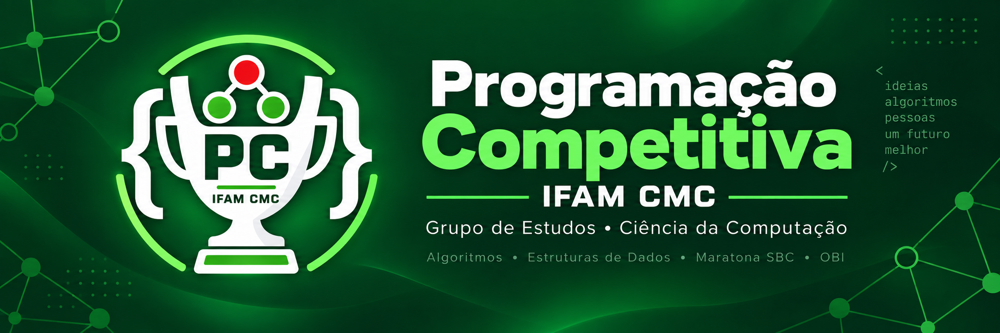

<p align="center">
  
</p>

<p align="center">
  <a href="./aulas/README.md"></a>
  <a href="./provas/README.md"></a>
  <a href="./materiais/README.md"></a>
  <a href="./materiais/competicoes/plataformas.md"></a>
</p>

<p align="center">
  
</p>

<h1 align="center">Programação Competitiva - IFAM CMC</h1>

<p align="center">
  Grupo de estudos do curso de Ciência da Computação do IFAM - Campus Manaus
  Centro dedicado a aprender, praticar e compartilhar Programação Competitiva.
</p>

## 🎯 Sobre o projeto

Construímos uma base sólida de interpretação, implementação e testes antes de
avançar para algoritmos e estruturas de dados mais complexos. O repositório
acompanha as aulas do grupo, reúne materiais de apoio e mantém um acervo de
provas para prática.

| | Objetivo |
| --- | --- |
| **📚 Aprender** | Desenvolver raciocínio lógico e técnicas de resolução de problemas. |
| **💻 Praticar** | Criar uma rotina com exercícios, aulas e simulados. |
| **🤝 Compartilhar** | Discutir ideias e diferentes abordagens em comunidade. |
| **🏆 Competir** | Preparar equipes para a OBI e a Maratona SBC de Programação. |

## 🧭 Comece aqui

| Se você procura... | Acesse |
| --- | --- |
| Conteúdo apresentado nos encontros | [Aulas](aulas/README.md) |
| Cadernos para praticar | [Provas da OBI e da Maratona SBC](provas/README.md) |
| Explicações de fundamentos | [Materiais](materiais/README.md) |
| Cursos para começar do zero | [Recursos online](materiais/comecando/recursos-online.md) |
| Onde resolver problemas | [Plataformas para praticar](materiais/competicoes/plataformas.md) |
| Quais competições disputar | [Competições e contests](materiais/competicoes/competicoes.md) |
| Oportunidades para programadoras | [Espaço das Programadoras](materiais/competicoes/programadoras.md) |
| Como configurar e executar código | [Ambiente de prática](materiais/comecando/ambiente-de-pratica.md) |
| Raciocínio visual antes do código | [Introdução a fluxogramas](materiais/comecando/fluxogramas.md) |
| Planejamento de conteúdo | [Roadmap 2026](roadmap/2026.md) |

## 📚 Aulas

| Aula | Data | Conteúdo |
| --- | --- | --- |
| [Aula 00 - Introdução](aulas/2026/aula-00-introducao/README.md) | 18/09/2026 | Formato dos problemas, Ad-Hoc, compilação e testes |

## 💻 Pratique

Comece com problemas introdutórios em português e avance gradualmente para
contests. Consulte o guia de [plataformas para praticar](materiais/competicoes/plataformas.md),
com recomendações para beecrowd, Neps Academy, OBI, HackerRank, Codeforces,
AtCoder, CSES e LeetCode.

Antes de submeter, compile e execute localmente. O guia de
[ambiente de prática](materiais/comecando/ambiente-de-pratica.md) mostra como
escolher um editor, desativar sugestões automáticas e usar o terminal em vez de
depender de um botão de execução.

## 🏆 Competições

Consulte o guia de [competições e contests](materiais/competicoes/competicoes.md).
Ele reúne opções recorrentes abertas ao público, disputas on-line e uma
competição universitária em equipes.

## 🌸 Programadoras

O [Espaço das Programadoras](materiais/competicoes/programadoras.md) reúne
competições femininas no Brasil, caminhos para representar o país na EGOI e
oportunidades latino-americanas.

## 🌱 Aprender sem saber programar

Programação Competitiva começa pelo raciocínio, não pela sintaxe. Os materiais
introdutórios usam explicações em linguagem natural e fluxogramas para que quem
ainda não conhece C++ ou Python possa participar das aulas e resolver os
problemas no papel.

- siga a seleção de [cursos e recursos para iniciantes](materiais/comecando/recursos-online.md);
- comece pelo material [Fluxogramas: resolvendo antes de programar](materiais/comecando/fluxogramas.md);
- acompanhe as setas e teste exemplos como se você fosse o computador;
- compare sua ideia com as resoluções visuais antes de abrir o código;
- use as descrições em palavras caso seu leitor não renderize Mermaid.

<details>
<summary><strong>Como aproveitar melhor cada aula</strong></summary>

1. Leia o material e identifique entrada, saída e limites.
2. Descreva a solução em palavras ou em um fluxograma antes de programar.
3. Implemente e crie seus próprios casos de teste.
4. Consulte as dicas gradualmente quando estiver travado.
5. Compare sua abordagem com as referências somente depois de tentar.

</details>

## 🗂️ Estrutura

```text
programacao-competitiva/
├── assets/       # identidade visual e divulgação
├── aulas/        # encontros organizados por ano
├── materiais/    # fundamentos e referências
├── provas/       # cadernos da OBI e da Maratona SBC
└── roadmap/      # planejamento do grupo
```

## 🛠️ Ambiente

Os exemplos iniciais usam C++17 e Python 3.

```bash
g++ -Wall -Wextra -pedantic -std=c++17 arquivo.cpp -o programa
./programa < entrada.in
```

## 🤝 Comunidade

Use o GitHub Discussions para dúvidas e troca de abordagens. Evite publicar uma
solução completa de imediato: descreva primeiro o que tentou, onde travou e
quais casos de teste analisou.

Contribuições são bem-vindas. Consulte o [guia de contribuição](CONTRIBUTING.md)
e o [código de conduta](CODE_OF_CONDUCT.md).

## 👥 Contribuidores

<p>
  <a href="https://github.com/gabriel-colares" title="Gabriel Colares">
    
  </a>
</p>

## 📄 Licença

O conteúdo produzido pelo grupo é disponibilizado sob a [Licença MIT](LICENSE).
Provas e outros materiais de terceiros permanecem sujeitos aos direitos de seus
respectivos autores.
