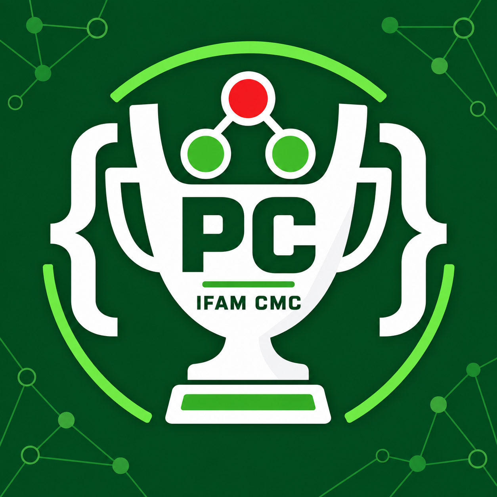

# Programação Competitiva IFAM

<p align="center">
  
</p>

Repositório do grupo de estudos de Programação Competitiva do curso de Ciência
da Computação do IFAM Campus Manaus Centro, iniciado com estudantes da 1ª e da
2ª turmas.

Estamos construindo a base: interpretação de enunciados, entrada e saída,
raciocínio passo a passo e problemas Ad-Hoc. Conteúdos mais avançados serão
adicionados gradualmente, conforme o grupo avançar.

## Objetivos

- desenvolver raciocínio lógico e prática de resolução de problemas;
- aproximar estudantes por meio de treinos e discussão de soluções;
- criar uma rotina de estudos e contests;
- preparar equipes para a OBI e para a Maratona SBC de Programação.

## Conteúdo

| Encontro | Tema | Materiais |
| --- | --- | --- |
| [Aula 0](aula-0/) | Introdução e problemas Ad-Hoc | Slides, prova da OBI 2026 e problema Elevador |

## Como estudar

1. Leia o material da aula.
2. Escolha um problema e identifique a entrada, a saída e os limites.
3. Resolva alguns exemplos no papel antes de programar.
4. Implemente e teste sua própria solução.
5. Só depois compare sua ideia com as soluções de referência.

## Ambiente

Os exemplos iniciais usam C++17 e Python 3.

```bash
# C++
g++ -Wall -Wextra -std=c++17 arquivo.cpp -o programa
./programa < entrada.in

# Python
python3 arquivo.py < entrada.in
```

## Estrutura

```text
.
├── aula-0/       # primeiro encontro e exercícios
├── design/       # identidade visual e peças de divulgação
└── README.md
```

Contribuições dos participantes são bem-vindas. Antes de enviar uma solução,
consulte o [guia de contribuição](CONTRIBUTING.md).

## Licença

O conteúdo produzido pelo grupo é disponibilizado sob a [Licença MIT](LICENSE).
Materiais de terceiros, como provas da OBI, permanecem sujeitos aos direitos de
seus respectivos autores.
