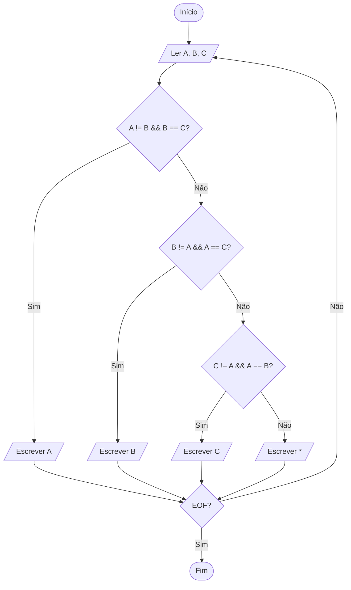

# Resolução visual - Zerinho ou Um

O fluxograma representa as mesmas decisões das soluções em C++ e Python, mas
não exige conhecimento prévio de programação.

## Leitura em palavras

1. Compare o valor de Alice com os outros dois.
2. Se somente Alice for diferente, a resposta é `A`.
3. Caso contrário, faça a mesma verificação para Beto e depois para Clara.
4. Se ninguém for o único diferente, a resposta é `*`.
5. Repita enquanto houver outro caso na entrada.
