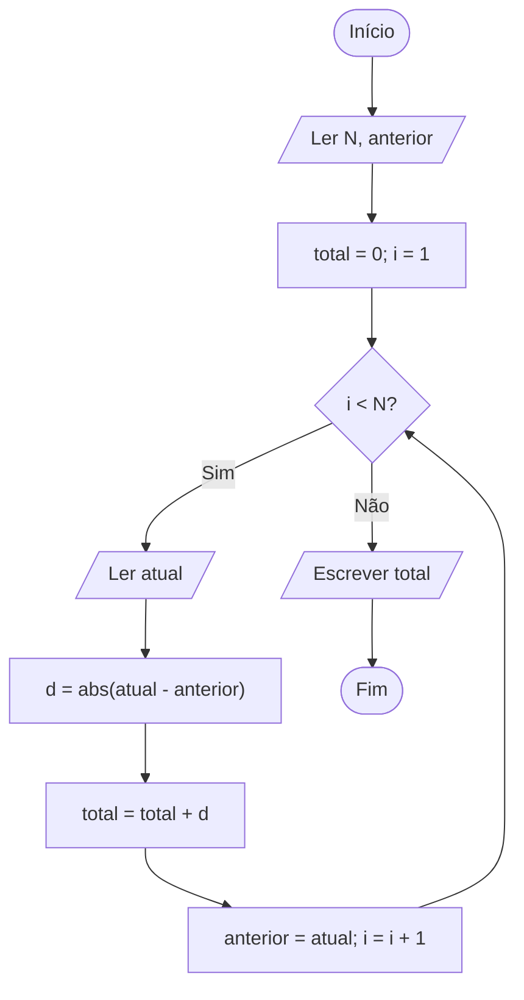

# Dicas - Elevador

Abra uma dica por vez. Não é necessário conhecer uma linguagem de programação
para acompanhar o raciocínio.

Dica 1 - observe duas paradas

O tempo entre duas paradas depende apenas da distância entre os dois andares.
Desenhe os andares em uma reta e conte quantas posições separam as paradas.

Dica 2 - subindo ou descendo

A distância deve ser positiva tanto na subida quanto na descida. A distância
entre os andares 3 e 8 é a mesma nos dois sentidos.

Dica 3 - percurso completo

Analise cada par de paradas consecutivas e acumule as distâncias. Se existem
`N` paradas, quantos deslocamentos acontecem entre elas?

Dica 4 - guia visual

Em palavras: comece com total zero, percorra as paradas na ordem e some a
distância de cada deslocamento. Ao terminar, apresente o total.

