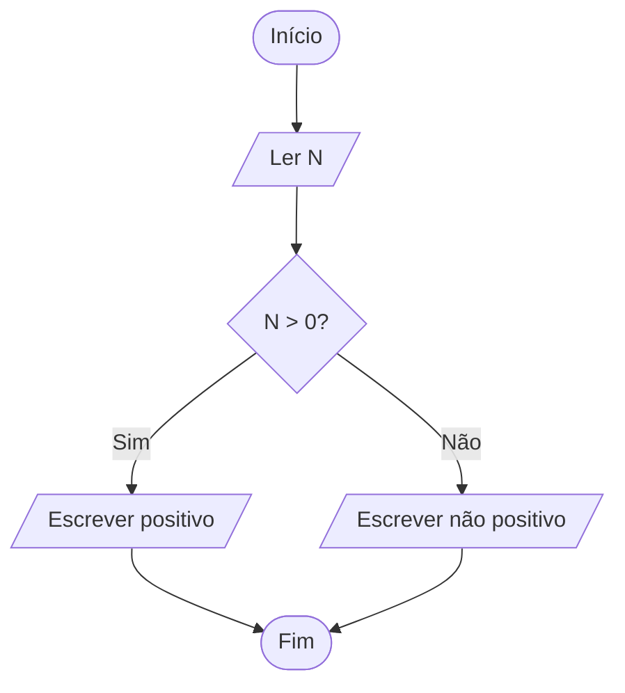

# Fluxogramas: resolvendo antes de programar

Um fluxograma descreve uma solução com formas e setas. Ele permite organizar o
raciocínio sem conhecer C++, Python ou qualquer outra linguagem.

## Formas mais usadas

| Forma | Significado |
| --- | --- |
| Oval | início ou fim |
| Paralelogramo | entrada ou saída de dados |
| Retângulo | ação ou cálculo |
| Losango | pergunta com caminhos diferentes |
| Seta | ordem em que os passos acontecem |

## Exemplo

O fluxo abaixo decide se um número é positivo.

Em palavras: leia o número, faça uma pergunta e siga a seta correspondente à
resposta. Só depois de conferir esse raciocínio é necessário transformá-lo em
código.

## Como criar um fluxograma para um problema

1. Escreva quais dados entram e qual resposta deve sair.
2. Transforme cada cálculo em uma ação curta.
3. Transforme cada decisão em uma pergunta respondida com “sim” ou “não”.
4. Ligue os passos com setas e verifique se todos os caminhos chegam ao fim.
5. Simule exemplos seguindo as setas como se você fosse o computador.

O GitHub renderiza diagramas escritos com Mermaid. Mesmo assim, nossas
resoluções visuais também incluem uma descrição em palavras para leitores de
tela e para ambientes que não exibem o diagrama.
